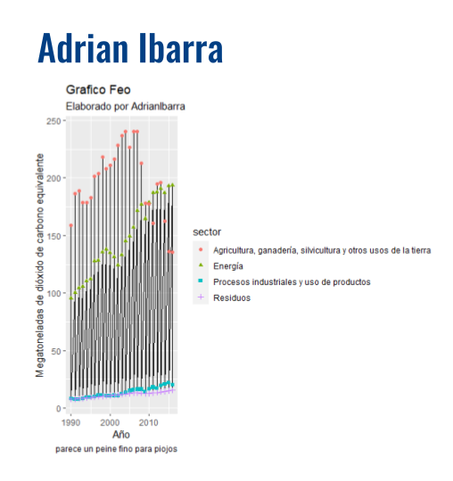
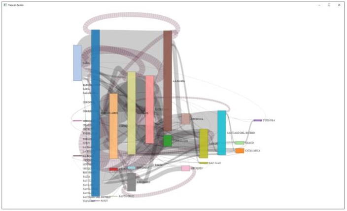
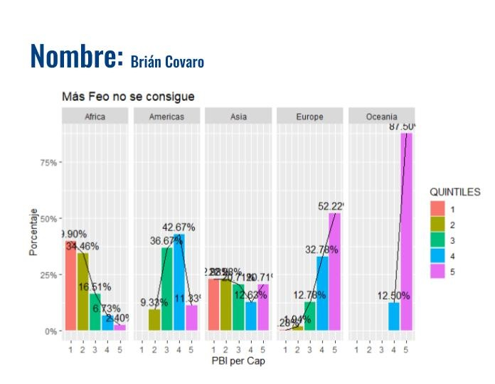
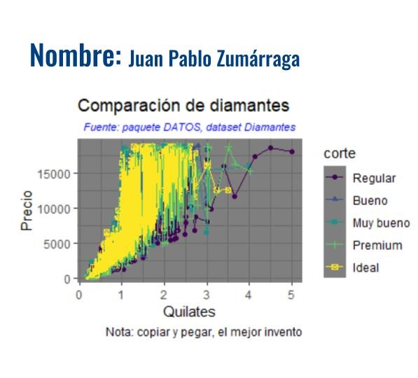
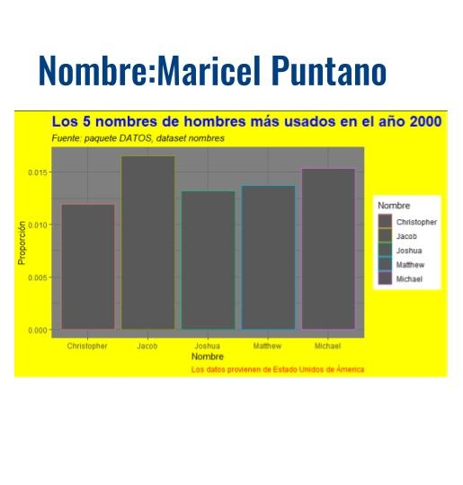
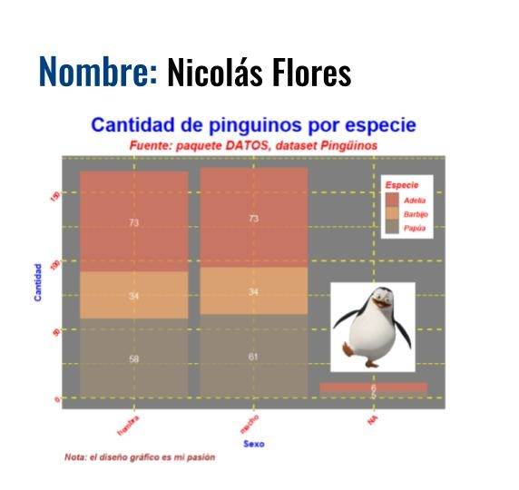
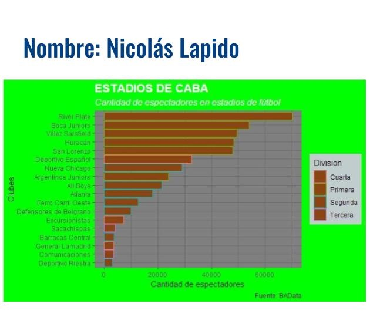
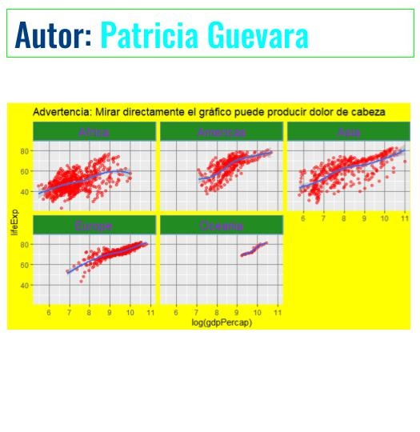
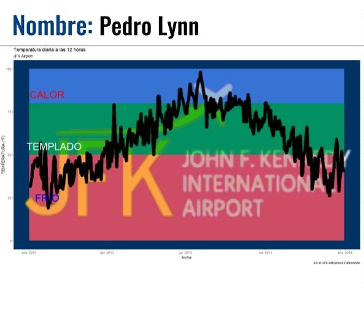
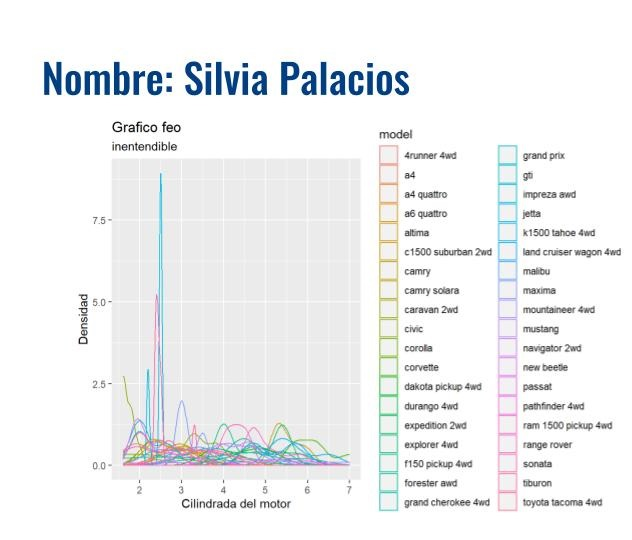

```{r setup, include=FALSE}
knitr::opts_chunk$set(echo = TRUE)

library(dplyr)
```

## Trabajos finales

Trabajos finales utilizando Tableau o RMarkdown y ggplot2. 

```{r echo=FALSE}
tribble(
  ~base, ~link,
"Incendios en el Amazonas", "https://tp-visualizacion.netlify.app/",
"Datos sobre Pokemon", "https://datospmk.netlify.app/",
"Datos propios (laborales)", "https://public.tableau.com/views/Trabajo_Vis/SiniestralidadyTrnsito-Ao2020?:language=es&:display_count=y&publish=yes&:origin=viz_share_link",
"Datos propios (laborales)", "https://public.tableau.com/profile/gus7549#!/vizhome/DashboardEjemplo_15886855017500/Dashboard1?publish=yes",
"Australia Fires", "https://mariceltpfinal.netlify.app/",
"Empleo y Género", "https://confident-ardinghelli-0ce418.netlify.app/",
"Datos propios (laborales)", "https://tp-visualizacion-aibarra-2.netlify.app/",
"Comercio Hispanoamérica-Mundo", "https://public.tableau.com/profile/nicolas6888#!/vizhome/TPFinal_16185317938040/Historia1?publish=yes",
"Vacunas contra COVID-19. Dosis Aplicadas en la República Argentina", "https://tpfinalvisualizacionpedro.netlify.app/",
"Datos propios (laborales)", "https://public.tableau.com/profile/fernando4071#!/vizhome/TPVISUALIZACION-UNaBTOTALPAIS/PORTADA1"
) %>% 
  mutate(link = paste0("<a href=", link, ">", link, "</a>")) %>% 
  DT::datatable(colnames = c("Base de datos seleccionada", "Link al trabajo final"),
                escape = FALSE)
```

## Concurso el gráfico más feo

### Adrian Ibarra

```{r eval=FALSE}
# base usada (emisiones_gei.csv)

gei %>%
  ggplot(aes(x = anio, y = emisiones)) +
  geom_ribbon(aes(ymin = emisiones - 1, ymax = emisiones + 1), fill = "grey10") +
  geom_line(aes(y = emisiones)) +
  geom_point(aes(color = sector, shape = sector)) +
  labs(x= "Año", y = "Megatoneladas de dióxido de carbono equivalente",
       title = "Grafico Feo",
       subtitle = "Elaborado por AdrianIbarra",
       caption = "parece un peine fino para piojos")
```




### Brian Corvaro

```{r eval=FALSE}
library("tidyverse")
library("dplyr")
library("patchwork")
library("ggplot2")
library("gapminder")
library("scales")

cuatro_cuatro = mutate(gapminder, gdpPercap_disc = ntile(gapminder$gdpPercap,5))

ggplot(data = cuatro_cuatro, aes(x= gdpPercap_disc,  group=continent)) + 
    geom_bar(aes(y = ..prop.., fill = factor(..x..)), stat="count") +
  geom_line(aes(y = ..prop.., fill = factor(..x..)), stat="count") +
  geom_text(aes( label = scales::percent(..prop..),
                 y= ..prop.. ), stat= "count", vjust = -.5) +
  labs(x= "PBI per Cap", y = "Porcentaje", fill="QUINTILES") +
  facet_grid(~continent) +
  ggtitle("Más Feo no se consigue") +
   scale_y_continuous(labels = scales::percent)
```



### Juan Pablo Zumárraga

```{r eval=FALSE}
library(gapminder)
library(ggplot2)
library(tidyverse)
library(datos)

diamantes %>%
  ggplot(aes(quilate, precio)) +
  geom_point(aes(color = corte, shape = corte)) +
  geom_line(aes(color = corte))+
   labs(x= "Quilates", y = "Precio", 
        title = "Comparación de diamantes",
        subtitle = "Fuente: paquete DATOS, dataset Diamantes",
        caption = "Nota: copiar y pegar, el mejor invento")+
  theme_dark()+
     theme(plot.subtitle = element_text(colour = "blue", face = "italic", size = 8, hjust = 0.5))
```




### Maricel Puntano

```{r eval=FALSE}
nom <- datos::nombres
nom %>%
  filter(anio==2000 & sexo =="M") %>%
  select(nombre, prop)%>%
  top_n(5)%>%
  ggplot(aes(nombre, prop, color= nombre)) +
  geom_col() +
  labs(
       x = "Nombre",
       y= "Proporción",
       title = "Los 5 nombres de hombres más usados en el año 2000",
       subtitle = "Fuente: paquete DATOS, dataset nombres",
       color = "Nombre",
       caption="Los datos provienen de Estado Unidos de Ámerica"
       ) +
  theme_dark() +
  theme(plot.caption = element_text(color = "red"), plot.title = element_text(size = 18, color = "blue", face = "bold"), plot.subtitle = element_text(face = "italic"),
        plot.background = element_rect(fill= "yellow"))
        
```



### Nicolas Flores

```{r eval=FALSE}
library(dplyr)
library(ggplot2)
library(datos)
library(png)
library(patchwork)
library(ggthemr)

img <- readPNG("data/image.png",native = TRUE) #la imagen fue descargada y guardada previamente

ggthemr('dust') #primero seteamos el theme

ggplot(pinguinos, aes(sexo, fill= especie))+
   geom_bar(alpha= 0.8)+
   geom_text(aes(label = ..count..),stat = "count",position = position_stack(0.5), colour = "white")+
   labs(x= "Sexo", y = "Cantidad", 
        title = "Cantidad de pinguinos por especie",
        subtitle = "Fuente: paquete DATOS, dataset Pingüinos",
        fill= "Especie",
        caption = "Nota: el diseño gráfico es mi pasión")+
   theme_dark()+
   theme(plot.title = element_text(colour = "blue", face = "bold", size = 25, hjust = 0.5))+
   theme(plot.subtitle = element_text(colour = "red", face = "bold.italic", size = 15, hjust = 0.5))+
   theme(panel.grid.major = element_line(color = "yellow", size = 1, linetype = "dashed"))+
   theme(panel.grid.minor = element_line(colour = "yellow",linetype= "longdash"))+
   theme(axis.title = element_text(colour = "blue", face = "bold"))+
   theme(axis.text.x = element_text(colour= "red",face = "bold", angle = 45, hjust = 1))+
   theme(axis.text.y = element_text(colour= "red",face = "bold", angle = 45, hjust = 1))+
   theme(legend.position = c(0.9, 0.8), legend.text = element_text(colour = "red", face = "bold.italic"))+
   theme(legend.title = element_text(colour = "red", face = "bold.italic"))+
   theme(plot.caption = element_text(colour = "brown", size = 11, face = "bold.italic", hjust = 0.01))+
   inset_element (p= img, left = 0.92,
                  bottom = 0.15,
                  right = 0.7,
                  top = 0.50)
```



### Nicolas Lapido

```{r eval=FALSE}
library(tidyverse)
library(datos)
library(here)
library(dplyr)
library(readr)
library(readxl)

estadios_caba <- read_excel("datos/estadios_caba.xlsx")

estadios_caba %>% 
  ggplot (aes(capacidad, fct_reorder(club, capacidad)))+
  geom_col (aes(color = Division),
            fill = "chocolate4")+
      theme_dark()+
  theme(plot.title = element_text(size = 16, colour = "white", face = "bold"), plot.subtitle = element_text(size = 12, colour = "white", face = "italic"), plot.background = element_rect (fill = "green"))+
  theme(legend.background = element_rect(fill = "azure3"))+
      labs (
    x = "Cantidad de espectadores",
    y = "Clubes",
    title = "ESTADIOS DE CABA",
    subtitle = "Cantidad de espectadores en estadios de fútbol",
    captions = "Fuente: BAData",
    color = "Division"
    )
```



### Patricia Guevara

```{r eval=FALSE}
library(dplyr)
library(ggplot2)
library(gapminder)
data("gapminder")

gapminder%>%filter(gdpPercap<70000 ) %>% 
  ggplot(aes( log(gdpPercap),lifeExp )) +
  geom_point(alpha = 0.5,color="red")+
  geom_smooth(method = loess)+
  facet_wrap(~continent) + 
  #theme(strip.background = element_rect(fill="#228b22"),
  theme(strip.background = element_rect(fill = "#228b22", colour = "#6D9EC1",
  size = 2, linetype = "solid"),
        strip.text = element_text(size=27, colour="purple")) +
  theme(plot.background = element_rect(fill = "yellow"),
        panel.grid.major = element_line(colour = "grey50" 
                                  )
        ) + 
  ggtitle("Advertencia: Mirar directamente el gráfico puede producir dolor de cabeza")

```



### Pedro Lynn

```{r eval=FALSE}
library (datos)
library (tidyverse)
library (png)
library (ggpubr)
img.file <- "imagenes/JFK_Airport_Logo.png"
img <- png::readPNG(img.file)

clima <- datos::clima
grafico_feo <- clima  %>%
  filter(origen == "JFK" & hora == 12 & anio == max(anio) ) %>%
  mutate (fecha = as.Date(paste(anio, mes, dia, sep="-"),"%Y-%m-%d")) %>%
 
  ggplot (aes(y = temperatura, x = fecha))+
  ggpubr::background_image(img)+
  geom_rect(aes(xmin=as.Date("2013-01-01"),xmax=as.Date("2013-12-31"),ymin=0,ymax=50,fill="blue"), alpha=0.01)+
  geom_rect(aes(xmin=as.Date("2013-01-01"),xmax=as.Date("2013-12-31"),ymin=50,ymax=80,fill="green"), alpha=0.01)+
  geom_rect(aes(xmin=as.Date("2013-01-01"),xmax=as.Date("2013-12-31"),ymin=80,ymax=100,fill="red"), alpha=0.01)+
  geom_line(aes(size = 3))+
  annotate("text", x=as.Date(c("2013-01-22")), y=85, label= "CALOR", size = 10, colour = "red")+
  annotate("text", x=as.Date(c("2013-01-30")), y=55, label= "TEMPLADO", size = 10, colour = "white")+
  annotate("text", x=as.Date(c("2013-01-22")), y=25, label= "FRÍO", size = 10, colour = "blue")+
  labs(
    x = "fecha",
    y = "TEMPERATURA (°F)",
    title = "Temperatura diaria a las 12 horas",
    subtitle = "JFK Airport",
    caption = "En el JFK utilizamos Fahrenheit"
    )
 
grafico_feo
```



### Silvia Palacios

```{r eval=FALSE}
# Cargamos la libreria ggplot2 para trabajar

library(ggplot2)

# Se utilizó datos de mpg.
# Se presenta una comparación de los datos obtenidos en mpg, de la cilindrada del motor y el modelo de auto.

ggplot( data = mpg, aes(displ, color=model) ) +
  geom_density()+
  labs(title = "Grafico feo", subtitle = "inentendible",
       x = "Cilindrada del motor", y ="Densidad" )
```

