```{r setup, include=FALSE}
knitr::opts_chunk$set(echo = TRUE)

library(dplyr)
```
## Trabajos finales

Trabajos finales utilizando Tableau o RMarkdown y ggplot2. 

```{r echo=FALSE}
tribble(
  ~base, ~link, ~autores,
"Empleo y Género (Banco Mundial)", "https://data-viz-r.netlify.app/","Couto, Aramburu, Araujo",
"Encuesta Permanente de Hogares", "https://ephybrechas.netlify.app/","Juan Videla y Juan Pablo Costa",
"Encuesta Permanente de Hogares", "https://ingresos-genero-desigualdades.netlify.app/", "Nicole Moscovich",
"Encuesta Nacional de Hogares", "https://trabajovisualizacion.netlify.app/","Marcela Almeida",
"Exportaciones certificadas de soja SENASA", "https://vibrant-wozniak-6e07cd.netlify.app/", "Alexander Sothmann,Luciano Tincani, Sara Reidel, Pamela Sarco",
"Programa Punto Digital", "https://public.tableau.com/app/profile/ana.clara.suiffet/viz/ResumenPuntosDigitales/ResumenPuntosDigitales?publish=yes", "Ana Clara Suiffet",
"Monitor de vacunación COVID-19 en la ciudad de Corrientes", "https://public.tableau.com/views/Trabajopracticofinalvisualizacion/MonitordevacunacinporCovid-19enlaCiudaddeCorrientes?:language=en-US&publish=yes&:display_count=n&:origin=viz_share_link","Bianca Vallejos
",
"COVID-19 en CABA", "https://tp-visualizacion-lindenboim-lucena.netlify.app/","Erika D. Lucena, Irene L. Lindenboim",
"COVID-19 - Chubut", "https://diplounab-chubut.netlify.app/","Federico Santoro",
"Estimaciones Agrícolas del Ministerio de agricultura, ganadería y pesca","https://agitated-easley-c144bb.netlify.app/","Yanil Hepp",
"Ecobicis Buenos Aires", "https://ecobicibuenosaires.netlify.app/","Marcelo Perazzo - Paula D’Alessandro",
"Hablemos de Todo","https://public.tableau.com/app/profile/nicolas7443/viz/HDTNicolsNatali/Dashboard1?publish=yes","Nicolás Natali",
"Contratos de alquiler del estado", "https://public.tableau.com/views/TPFINALVISUALIZACIONES/VISUALIZACIONES?:language=es-ES&publish=yes&:display_count=n&:origin=viz_share_link", "Noelia Andrada",
"Vinos", "https://public.tableau.com/app/profile/edgardosandoval/viz/VinosSand/Dashboard1","Edgardo Sandoval"
) %>% 
  mutate(link = paste0("<a href=", link, ">", link, "</a>")) %>% 
  DT::datatable(colnames = c("Base de datos seleccionada", "Link al trabajo final", "Autores/as"),
                escape = FALSE)
```
## Concurso el gráfico más feo (por orden alfabético)

### Agustín Osés

```{r eval=FALSE}
library(dplyr)
library(ggplot2)
library(readr)
library(tidyverse)
library(readxl)
library(datos)
library(png)
library(patchwork)

petroleo <- readPNG("datos/petroleo.png",native = TRUE)
torres <- readPNG("datos/torres.png",native = TRUE)

aviones_2 <- aviones %>% 
  group_by(anio) %>% 
  summarise(mean(asientos))
  
  colnames(aviones_2) <- c("anio", "promedio")

ggplot(aviones_2, aes(x=anio, y=promedio)) +
  theme_dark()+
  theme(plot.title = element_text(size = 15, colour = "brown", face = "italic"), plot.subtitle = element_text(size = 12, colour = "yellow", face = "italic"), plot.background = element_rect (fill = "violet"), plot.caption = element_text(size=9, color = "green"))+
  theme(panel.grid.major = element_line(color = "grey", size = 1, linetype = "dashed"))+
  theme(axis.title = element_text(colour = "orange", face = "italic", size = 20))+
  theme(axis.text.x = element_text(colour= "red", angle = 60,))+
  theme(axis.text.y = element_text(colour= "red", angle = -45,))+
  labs(x= "año", y = "asientos Promedio", title = "Cantidad Promedio de Asientos Por Avión Según Año de Fabricación", subtitle = "capacidad promedio de Aeronaves y su relación con hEchos históricos", caption = "fuente: paquete datos, DATASET Aviones, según registros de la FAA (Administración Federal de Aviación, EEUU") +
  geom_rect(aes(xmin=1956,xmax=1973,ymin=-0,ymax=250), fill="Brown", alpha=1)+
  geom_rect(aes(xmin=1973,xmax=2001,ymin=-0,ymax=250), fill="Yellow", alpha=1)+
  geom_rect(aes(xmin=2001,xmax=2013,ymin=-0,ymax=250), fill="Green", alpha=1)+
  geom_point(aes(size=promedio), colour="blue", shape=17)+
  geom_vline(aes(xintercept=1973), colour=1, size=3)+
  geom_vline(aes(xintercept=2001), colour=2, size=3)+
  geom_smooth(size=3, colour ="Grey")+ 
  inset_element (p= torres, left = 0.9, bottom = 0.15, right = 0.7, top = 0.50)+
  inset_element (p= petroleo, left = 0.25, bottom = 0.65, right = 0.40, top = 1)

```

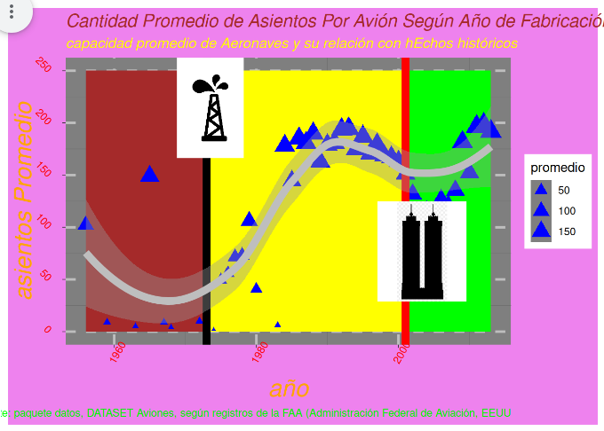


### Alexander Sothmann

#### Gráfico enviado al concurso

```{r eval=FALSE}
library(tidyverse)
paises <-datos::paises

paises_filtrado <- filter(paises,anio>=2000 & anio<=2021)
ggplot(paises, aes(x = poblacion, y = esperanza_de_vida))+  
  geom_point(aes(size = pib_per_capita))+
  scale_size_area(max_size = 15, guide = NULL) +
  scale_x_log10()+
  geom_smooth(method = "lm", se = FALSE, aes(color = anio))+
   facet_wrap(~continente)+
  labs(title = "Paises del mundo",
       subtitle = "Año 2000 a 2021",
       caption = "El tamaño de cada circulo representa el producto bruto interno por cada habitante.",
       x = "poblacion",
       y = "Life expectancy",
       color = "")
```

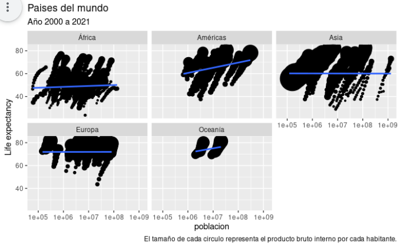

#### Gráfico 3D extra

```{r eval=FALSE}
library(scatterplot3d)
paises <-datos::paises

x <- paises$poblacion
y <- paises$esperanza_de_vida
z <- paises$anio

scatterplot3d(x, y, z, pch = 19, color = "blue")
```

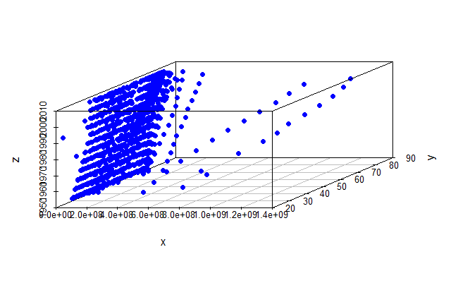

### Ana Clara Suiffet


```{r eval=FALSE}
ggplot(provincia_porc, aes(x=1, y=percentage,fill=provincia)) +
  geom_bar(stat="identity") +
  scale_fill_manual(values=rainbow(24)) +  
  geom_text(aes(label = paste0(round(percentage,1),"%")), 
                  position = position_stack(vjust = 0,5)) +
  coord_polar(theta= "y") +
  theme_void()+
  labs(
    x = "Provincias Argentinas",
    y = "Porcentaje de Puntos Digitales",
    title="Porcentaje de Puntos Digitales por Provincias",
    subtitle = "Intento n°99247892 con lo que Yani detesta: gráfico de torta en 3D o 45° y colorinche",
    fill = "Porcentaje",
    caption = "Fuente: mapa de Puntos Digitales https://mapa.puntodigital.gob.ar/")
```

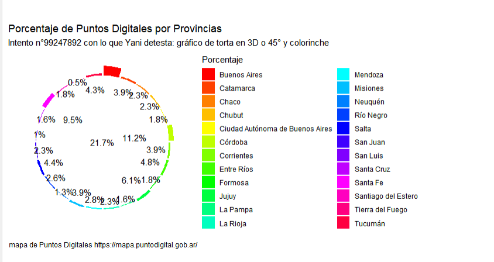
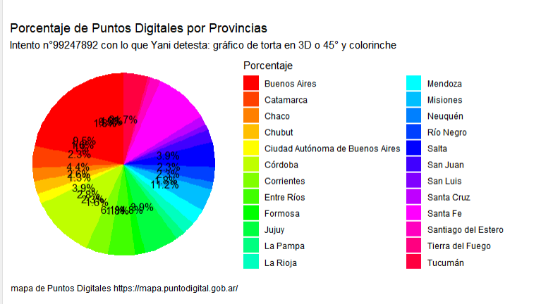

### Analia Savino

```{r eval=FALSE}
expo_biodiesel <- expo_biodiesel %>% 
  mutate(fecha_corregida = dmy(fecha))

expo_biodiesel <- expo_biodiesel %>% 
  select(fecha_corregida, pais_destino, cantidad_ton, monto_fob) %>% 
  mutate(ano = year(fecha_corregida))

exp_bio_limpio <- expo_biodiesel %>% 
  group_by(pais_destino) %>% 
  summarise(cant_ton =sum(cantidad_ton), monto = sum(monto_fob)) %>% 
  ungroup() %>% 
  filter(cant_ton <=15000)

ggplot(exp_bio_limpio) +
  geom_col(aes(x= pais_destino, y= cant_ton, fill=monto))+
  labs(title = "Paises a los que menos biodisel exporatmos",
       x="Paises", 
       y= "Toneladas")
```

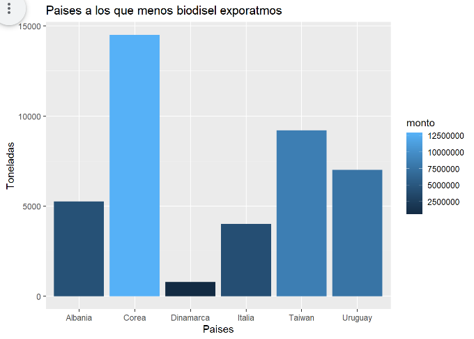

### Bianca Vallejos

```{r eval=FALSE}
# Fuente de datos: cotizaciones extraidas de Ambito (https://www.ambito.com/contenidos/merval-historico.html)

grafico_1 <- ggplot(cotizacion, aes(fecha, precio_cierre, col = mes)) +
  geom_line() +
  geom_point() + 
  theme(axis.title.x=element_blank(),
        axis.text.x=element_blank(),
        axis.ticks.x=element_blank(),
        panel.background = element_rect(fill="light green"),
        text=element_text(family="Comic Sans MS")) +
  labs(title = "Cotizacion diaria del MERVAL", subtitle = "Año 2021")
grafico_final <- ggdraw(grafico_1) + 
  draw_image("https://i.pinimg.com/564x/44/a3/d1/44a3d17dea5ec11f27445fece8e137ba.jpg",
             scale = .43, x = 1, hjust = 1, halign = 0.135, valign = 0.12)
grafico_final

ggsave("grafico_final.jpg", width = 7, height = 4)
```

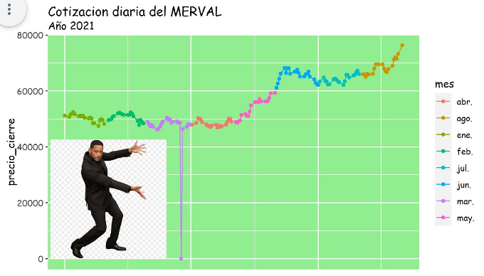

### Erika Lucena

```{r eval=FALSE}
library(datos)
library(readr)
library(dplyr)
library(ggplot2)
library(png)
library(patchwork)

precio_mediana<- diamantes %>% 
  summarise(precio_mediana= median(precio))

precio_max<- diamantes %>% 
  summarise(precio_max= max(precio))


grafico_feo <- diamantes %>% 
  ggplot()+
  geom_boxplot(aes(corte, precio, fill=corte))+
  geom_line(aes(quilate, precio, color=corte))+
  labs(title='¿El precio del corte "Ideal" puede ser menor al resto de los cortes?', subtitle="La mediana del precio para el corte de análisis es menor que en el resto de los cortes", caption= "Fuente:Base Diamantes de la librería Datos de R")+
  geom_hline(data=precio_mediana, aes(yintercept = precio_mediana), color="yellow", linetype=2)+
  geom_hline(data=precio_max, aes(yintercept = precio_max), color="yellow", linetype=2)+
  theme(text= element_text(color="red", face="bold"), plot.background = element_rect (fill = "pink"), panel.grid.major.x= element_line(size=1, color="red", linetype = "3313"), panel.grid.major.y=element_line(size=1, color="red", linetype = "dotdash"),  legend.background= element_blank(), panel.background= element_rect(fill="green"))+
  annotate('text', x = 4.5, y = precio_mediana$precio_mediana-500, label = "Mediana del Precio para todos los cortes", fontface = "bold", size=2, color="yellow")+
  annotate('text', x = 4, y = precio_max$precio_max+500, label = "Precio Máximo", color="yellow", fontface = "bold", size=2)

grafico_feo 

```

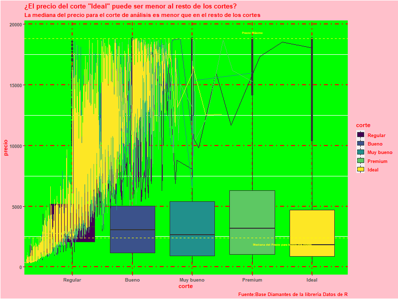

### Facundo Monti

```{r eval=FALSE}
ggplot(empresas, aes(x = Categoria, y = Provincia)) +
  geom_point(aes(color = "Provincia"))
```

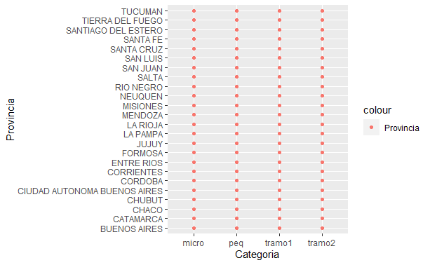

### Federico Aramburu

```{r eval=FALSE}
library(tidyverse)
library(ggplot2)

# Homero
homero <- tibble (x= c(3.7,3.5,3.32,3.8,4.4,4.6,5.0,4.6,3.9,3.6,3.7,3.8,3.82,3.85,3.95,3.82,3.7,3.68,
                     3.69,3.75,3.82,3.97,3.82,3.75,3.53,3.49,3.52,3.69,3.89,4.2,4.4,4.75,4.9,5.25,5.5,
                     5.6,5.7,5.78,5.72,5.65,5.52,5.48,5.44,5.35,5.29,5.25,5.16,5.25,5.29,5.35,5.44,
                     5.48,5.52,5.65,5.72,5.76,5.80,5.85,5.86,5.82,5.72,5.71,5.45,5.25,5.45,5.7095,
                     5.77,5.755,5.75,5.65,5.78,5.9,5.75,5.5,5.37,5.25,4.95,4.79,4.6,4.65,4.6,4.48),
                  y= c(1.5,1.47,0.87,0.515,0.23,0.87,0.36,0.87,1.15,1.46,1.38,2,2.51,2.5088,2.5095,2.514,
                     2.56,2.63,2.85,2.9,2.94,2.90,2.94,2.9,3.65,4.05,4.56,5.1,5.30,5.50,5.55,5.53,5.48,
                     5.20,4.85,4.55,4.15,4,3.85,3.89,3.91,3.92,3.91,3.88,3.85,3.83,3.75,3.83,3.85,3.88,
                     3.91,3.92,3.91,3.89,3.85,3.81,3.74,3.65,3.48,3.32,3.18,3.175,3.19,3.20,3.19,3.174,
                     3.05,2.98,2.87,2.8,2.18,2,1.87,1.74,1.73,1.732,1.75,1.84,2,2.1,2,1.9))
#82 puntos

oreja <- tibble (a = c(3.75,3.80,3.90,3.80,3.75,3.72 ,rep(NA,76)), 
                 b = c(2.65,2.75,2.83,2.75,2.83,2.81 ,rep(NA,76)),
                 m = c(3.5,3.52,3.75,3.85,4 ,rep(NA,77)),
                 p = c(2.98,3.40,3.08,3.50,3.12 ,rep(NA,77)))

boca <- tibble (bocax= c(5.16,5.45,5.70,5.77,5.755,5.75,5.65,5.50,5.40,5.25,4.8,4.65,4.45,4.32,4.23,
                         4.22,4.30,4.38,4.5,4.75,4.82,4.9,5.12,5.28,5.32,5.42,5.32,5.28,5.12,5.05,
                         5.10,5.13,5.2,5.23,5.20,5.52,5.08,5.52,5.50,5.52,5.40,5.19,5.28,rep(NA,39)),
                bocay= c(3.20,3.19,3.17,3.05,2.98,2.87,2.80,2.81,2.84,2.83,2.75,2.65,2.52,2.25,2.15,
                         1.84,1.68,1.47,1.25,1.18,1.16,1.19,1.3,1.475,1.53,1.71,1.53,1.475,1.3,1.10,
                         0.80,0.53,0.45,0.39,0.26,1.01,1.18,1.01,0.99,0.29,0.35,0.365,0.11,rep(NA,39)))

ojos <- tibble (ojox= 4.85,ojoy=3.465,ojox1=4.65,ojoy1=3.42,ojox2=5.4,ojoy2=3.42)


lata <- tibble (ll = c(8.5,8.6,9.6,9.5,rep(NA,78)),
                kk = c(5.5,4.0,4.0,5.5,rep(NA,78)),
                hh = c(8.53,8.58,9.55,9.5,rep(NA,78)),
                jj = c(5.2,4.55,4.59,5.24,rep(NA,78)))

homero %>% 
  ggplot()+
  geom_path( aes (x, y),size = 0.5, col="blue2")+
  geom_point(aes(ojos$ojox,ojos$ojoy), size=19, pch=1, col="blue2")+
  geom_point(aes(ojos$ojox1,ojos$ojoy1), size = 2)+
  geom_point(aes(ojos$ojox2,ojos$ojoy2), size = 2)+
  geom_path( aes (x = oreja$a, y = oreja$b),col="blue2") +
  geom_path( aes (x = oreja$m, y = oreja$p),size=0.6, col= "blue2") +
  geom_path( aes (x = boca$bocax, y = boca$bocay),size=0.5, col= "blue2") +
  geom_curve(aes(x=4.85, y=5.50, xend=4.15, yend=5.16), size=0.5,
             color="blue3", curvature = 1.3)+
  geom_curve(aes(x=4.6, y=5.55, xend=3.9, yend=5), size=0.5,
             color="blue3", curvature = 1.3)+
  geom_polygon(aes(lata$ll,lata$kk), fill="red", col="grey4",size=0.5)+
  geom_polygon(aes(lata$hh,lata$jj), fill="white", col="grey4")+
  geom_curve(aes(x=8.57, y=3.98, xend=9.61, yend=4.02), size=1.5,
             color="darkgrey", curvature = 0.06)+
  geom_curve(aes(x=8.5, y=5.48, xend=9.51, yend=5.51), size=1.5,
             color="darkgrey", curvature = -0.04)+
  geom_text(x = 9, y = 4.9, label ="Duff",col="black",size= 7,angle=2.5)+
  geom_text(x = 9.1, y = 4.3, label ="BEER",col="black",size= 3.5,angle=2.5)+
  geom_point(aes(x=9.1,y=4.7), size= 50, pch=1)+
  geom_point(aes(x=7.3,y=5.4), size= 12, pch=1)+
  geom_point(aes(x=6.5,y=5.2), size= 8, pch=1)+
  geom_point(aes(x=5.9,y=5), size= 4, pch=1)+
  scale_x_continuous(limits = c(0,10), breaks = c(1,2,3,4,5,6,7,8,9,10))+
  scale_y_continuous(limits = c(0,6), breaks = c(1,2,3,4,5,6))+
  geom_text(x = 1.5, y = 3, label = "La cerveza es\nla causa y\nsolución\nde todos\nlos problemas",
            size=6, angle= 3,col="green2")+
  theme_void()

 ggsave(paste0("homero",".png"))
 
# ***"La cerveza es la causa y solución de todos los problemas"*** - **Homero Simpson**

```

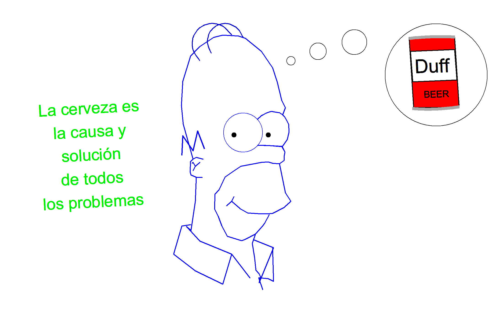


### Federico Gonzalez

```{r eval=FALSE}
library(ggplot2)
library(babynames)
library(dplyr)
library(hrbrthemes)
library(viridis)

don <- babynames %>%
filter(name %in% c("Luke", "Christian", "Edward")) %>%
filter(sex=="M")

#Tips: 
#No se entiende a que apunta el grafico, no se entiende que son las lineas, hay un solo color. 
#No hay explicación anexa al grafico 
#Mas horrible no se consigue

don %>%
ggplot( aes(x=year, y=n, group=name, color=name)) +
geom_line(color='black') +
ggtitle("Popularity of American names in the previous 30 years") +
ylab("Number of babies born")
```

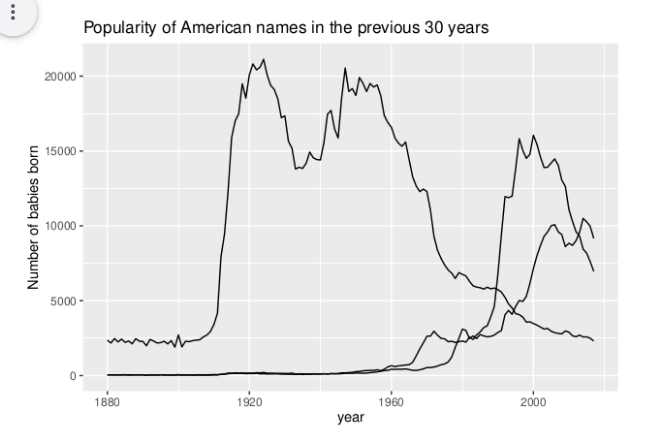


### Federico Santoro

```{r eval=FALSE}
dia_max<-as.Date("2020-12-31")

prov %>% 
    ggplot(aes(x = FIS, fill = Fallecido))+
    geom_histogram(binwidth = 30, color = "limegreen")+
    scale_x_date(date_breaks = "7 days", date_labels = "%W",expand = c(0,1))+
    scale_y_continuous(breaks = c(0,15,100,256,1032,2222,9876,15000,31000), labels = c(0,15,100,256,1032,2222,9876,15000,31000), limits = c(0,31000),expand = c(1,1))+
    labs( x = "Semana", y = "N.Casos", title = "Fallecidos en Chubut por Covid")+
    theme(legend.position = "left",
          legend.background = element_rect(fill = "magenta", colour = "yellow"),
          panel.background = element_rect(fill = "purple", colour = "black"),
          panel.grid.major.y = element_line(colour = "yellow"),
          plot.background = element_rect(fill = "#eaff00"),
          plot.title = element_text(size = rel(4)),
          axis.title.x = element_text(size = rel(1.5), angle = 60),
          axis.title.y = element_text(size = rel(1.5), angle = 60))+
  annotate(geom = "text", x = dia_max, y = 31000, label = "Maximo de muertos", fontface = "bold")+
  geom_curve(aes(x= dia_max, y = 27000, xend= dia_max, yend= 12000),
             curvature = -0.5,
             color = "red",
             arrow = arrow(length = unit(0.20, "inch")), size = 2)+
    geom_curve(aes(x= dia_max, y = 27000, xend= dia_max, yend= 12000),
             curvature = 0.5,
             color = "white",
             arrow = arrow(length = unit(0.20, "inch")), size = 2)

```

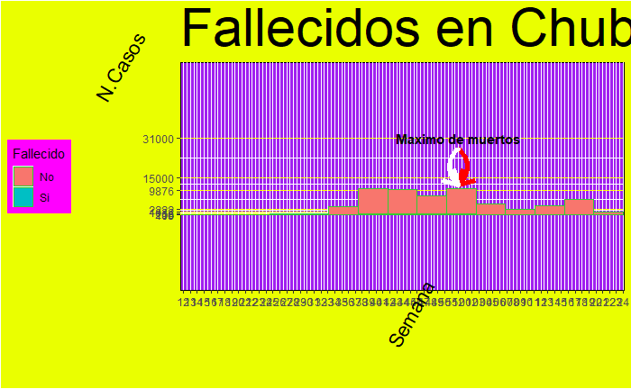


### Hernan Costa

```{r eval=FALSE}
# Cargamos con el paquete EPH la base individual del IV trim 2020
ind_4_20 <- get_microdata(year=2020, trimester=4, type='individual')

# Gráfico del ingreso total individual por género
# Nota: la variable CH04 toma dos valores (1= varón ; 2=mujer)

ggplot(ind_4_20, aes(CODUSU, P47T, color = CH04)) +
  geom_col(na.rm = TRUE)
```

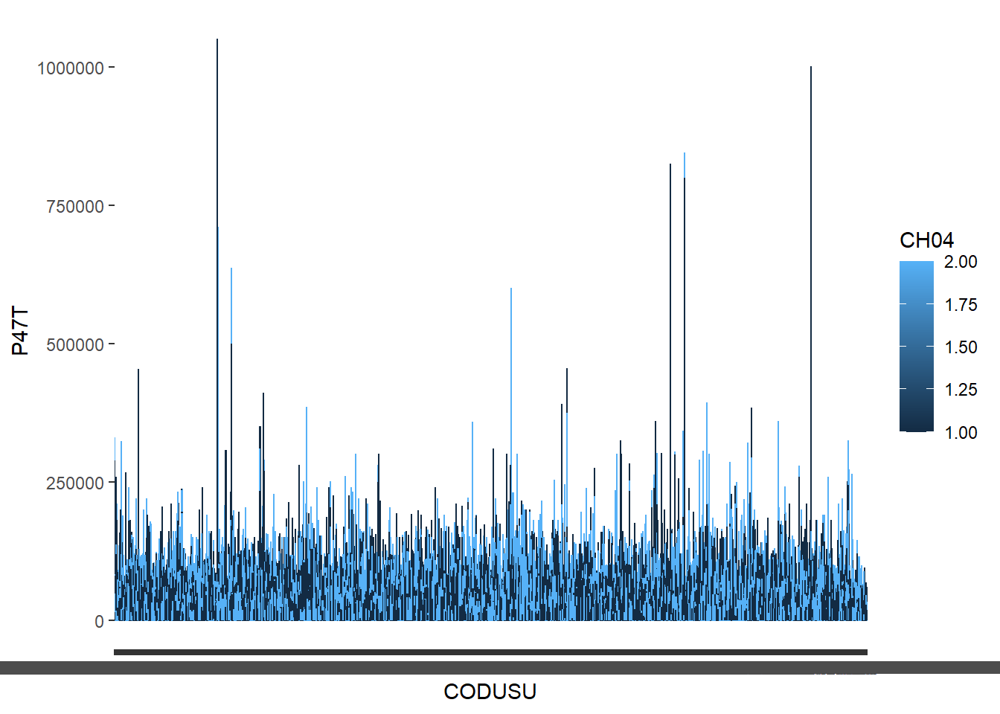


### Irene Lindenboim

```{r eval=FALSE}
enero_julio_programas %>%
  mutate(planificado_millones=planificado, ejecutado_millones=ejecutado) %>% 
      ggplot() +
      geom_col(aes(x=mes, y=planificado_millones, fill=programa)) +  
    labs(title = "Planificación y ejecución de programas", subtitle = "Montos en $ - enero a julio 2021", caption = "Observaciones: en las columnas se encuentran los montos planificados y en las líneas los montos ejecutados", x = "mes", y = "$", fill= "Programa")+
  geom_line(aes(x=mes, y=ejecutado_millones), color="red", size=1)+
  theme_dark()+
  theme(plot.caption.position = "plot",
        plot.caption = element_text(hjust = -1),
    legend.margin = margin(0, 10, 0, 10),
    plot.title = element_text(hjust = 0, vjust = 3, family = "mono"),
    panel.grid.major = element_line(color = "black"),
    plot.margin = margin(100, 50, 100, 50),
    legend.position = "left",
    legend.justification = "left",
        legend.box.background = element_rect(size = 5, color = "red"),
    text = element_text(color = "red"),
    axis.text = element_text(color = "red"),
    legend.text = element_text(color = "red"))+
    scale_fill_manual(values=c("red","blue", "white", "black", "yellow", "green" ))
```

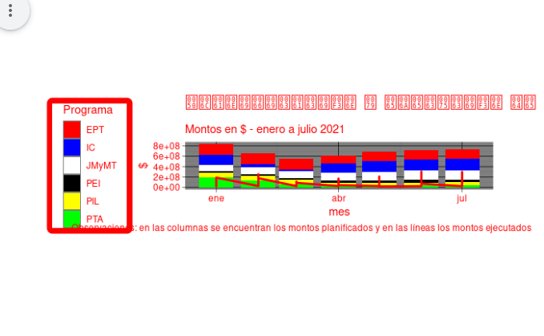


### Juan Videla

```{r eval=FALSE}
library(ggplot2)
library(datos)
library(dplyr)

aviones2002<- aviones %>% 
              filter(anio == "2002" )

ggplot(aviones2002, aes(fabricante))+
  geom_bar(aes(fill=fabricante))+
  scale_x_discrete(labels = c("Mirá las", "referencias", "en el","recuadro", "rojo"))+
  scale_y_continuous(breaks = seq(0, 200, 3.5), expand = c(0.1,0))+
  labs(x = "FaBrIcAnTe",  y= "Cantidad",
       title = "Cantidad de aviones por fabricante en el año 2002",
       caption = "Cualquier similitud entre los colores y el fútbol es pura coincidencia")+
  scale_fill_manual(values = c("#00008B","#0000FF", "#FFD700", "#DAA520", "#6A5ACD"))+
  theme_dark()+
  theme(legend.position = c( 0.7, 0.7),
        legend.background = element_rect(fill = "red", color = NA),
        panel.grid = element_line("red"))
```

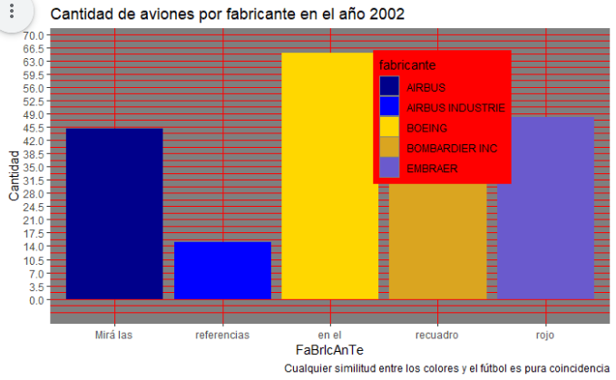


### Juan Pablo Costa

```{r eval=FALSE}
library(tidyverse)
library(ggplot2)
library(datos)

diamantes <- datos::diamantes


ggplot(diamantes)+
  geom_bar(aes(x=corte, fill=claridad))+
  labs(
    x="Tipo",
    y="Cantidad",
    title = "Cantidad de diamantes por tipo y claridad",
    fill = "Claridad")+
  scale_y_continuous(limits = c(0, 25000),
                     breaks = seq(0, 25000, 10000),
                     expand = c(2, 2))+
  scale_fill_manual(values=c("red","blue", "darkorange", "purple", "cyan4", "green", "orange", "pink" ))+
  theme_dark()+
  theme(legend.position = c( 0.7, 0.7),
        legend.background = element_rect(fill = "red", color = NA),
        panel.grid = element_line("red"))+
  save.image("datos/grafico_feo.jpg")

```

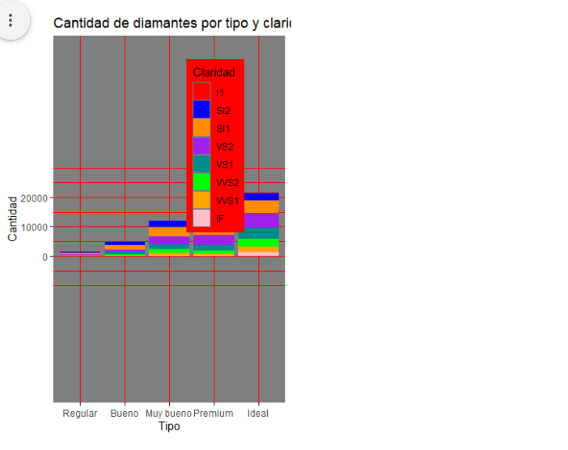


### Manuel Emilio Lopez

```{r eval=FALSE}

```


### Mercedes Araujo

```{r eval=FALSE}

```

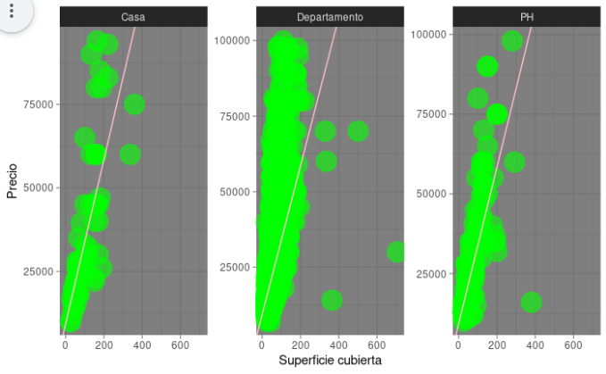


### Julieta Couto

```{r eval=FALSE}

```

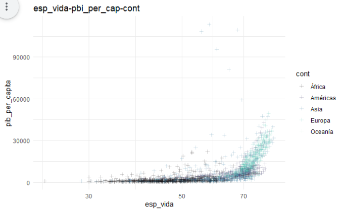

### Luciano Tincani y Pamela Sarco

```{r eval=FALSE}

```


### Marcela Almeida

```{r eval=FALSE}

```


### Marcelo Perazzo

```{r eval=FALSE}

```

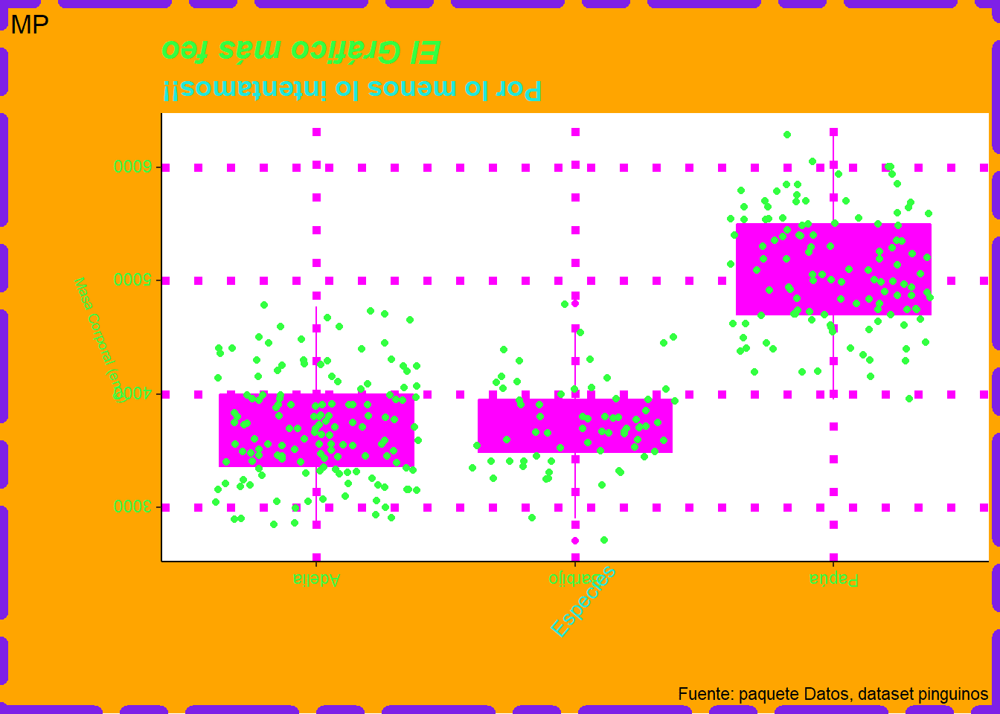

### Martina Pesce

```{r eval=FALSE}

```

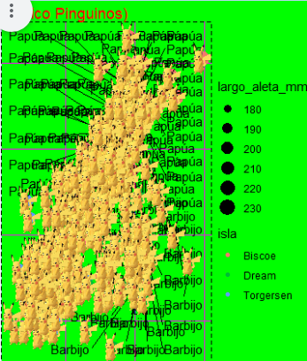

### Martin Saralegui

```{r eval=FALSE}

```

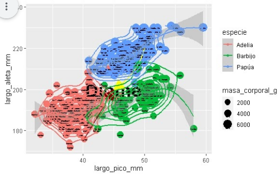


### Marcela Almeida 

```{r eval=FALSE}

```


### Mercedes Laurenza

```{r eval=FALSE}

```


### Nicolas Capria

```{r eval=FALSE}

```

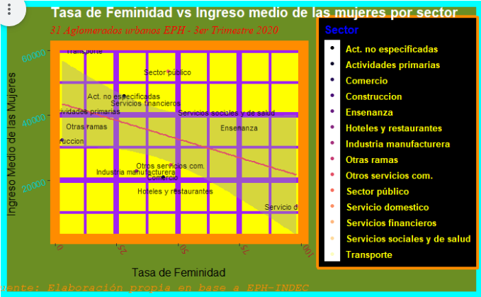

### Nicolas Natali

```{r eval=FALSE}

```

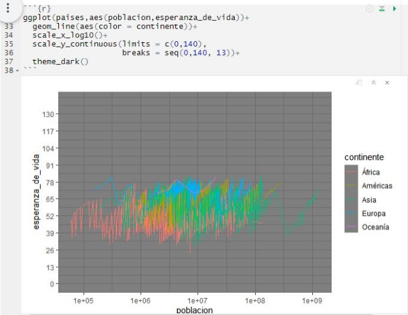

### Nicole Moscovich

```{r eval=FALSE}

```

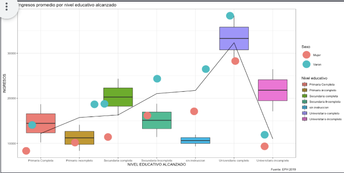


### Noelia Andrada

```{r eval=FALSE}

```

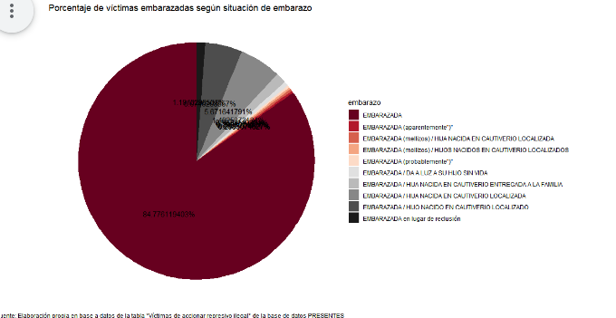

### Paula DAlessandro

```{r eval=FALSE}

```

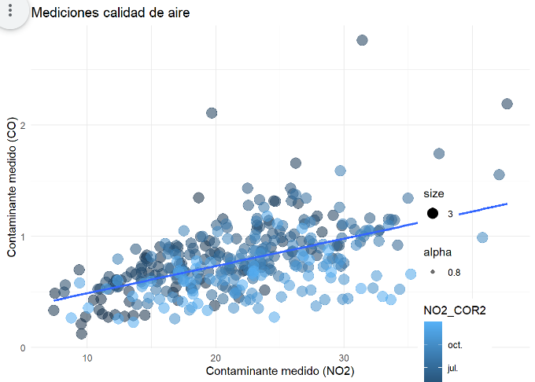

### Samantha Vaccari

```{r eval=FALSE}

```

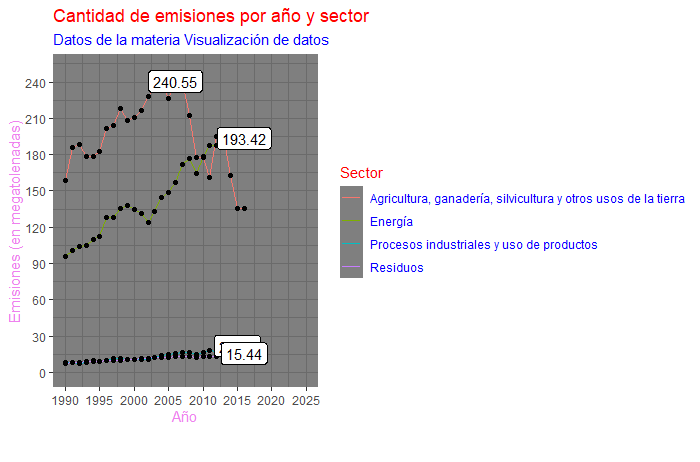

### Sara Reidel

```{r eval=FALSE}

```

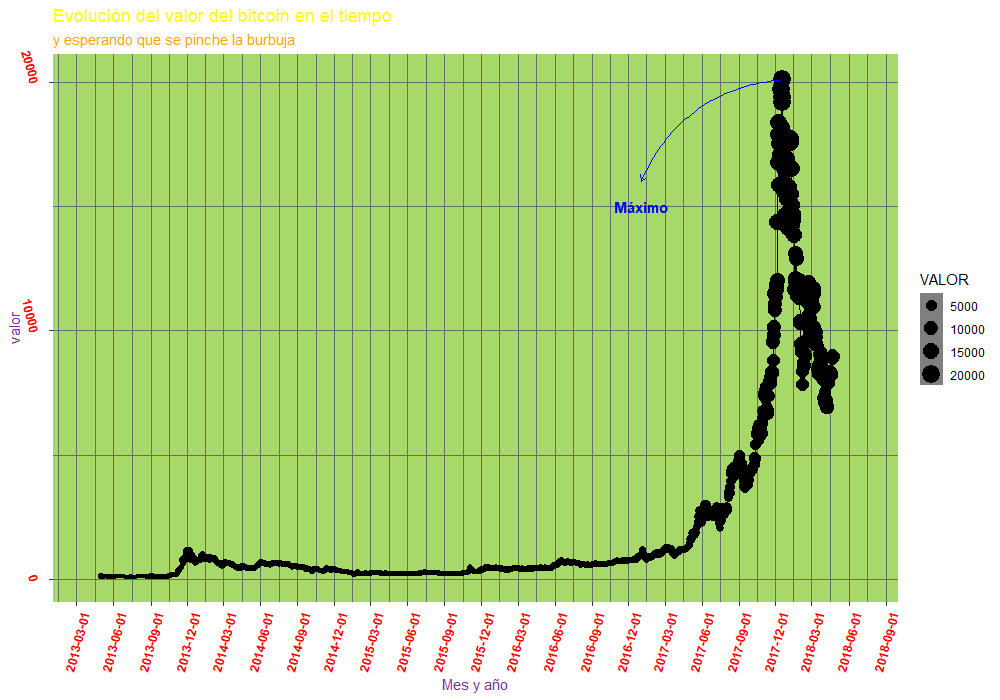


### Walter Martinez

```{r eval=FALSE}

```

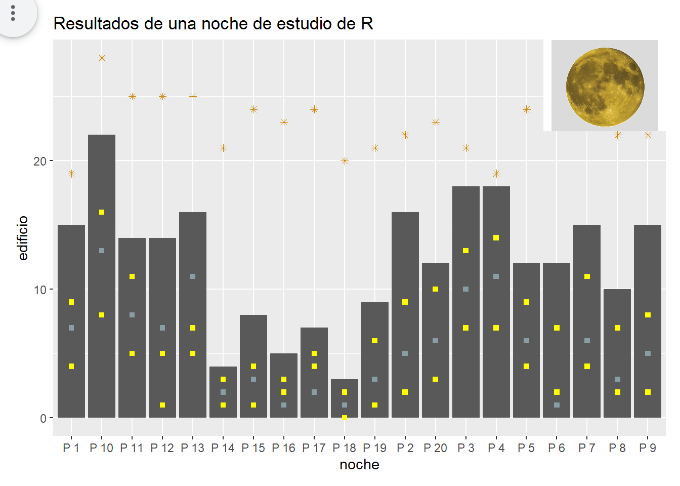

### Yamila Albornoz

```{r eval=FALSE}

```

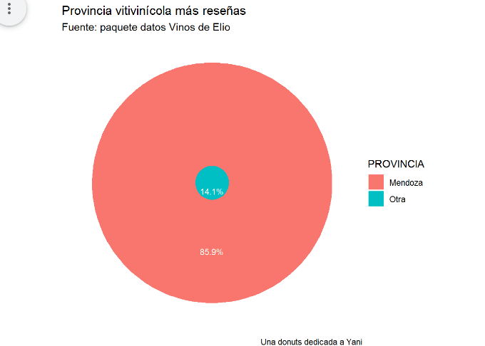

### Yanil Hepp

```{r eval=FALSE}

```

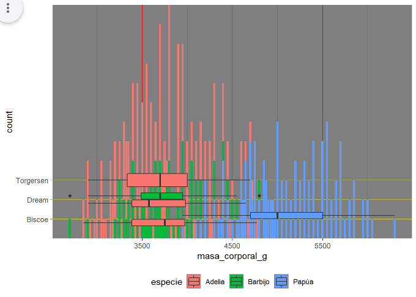