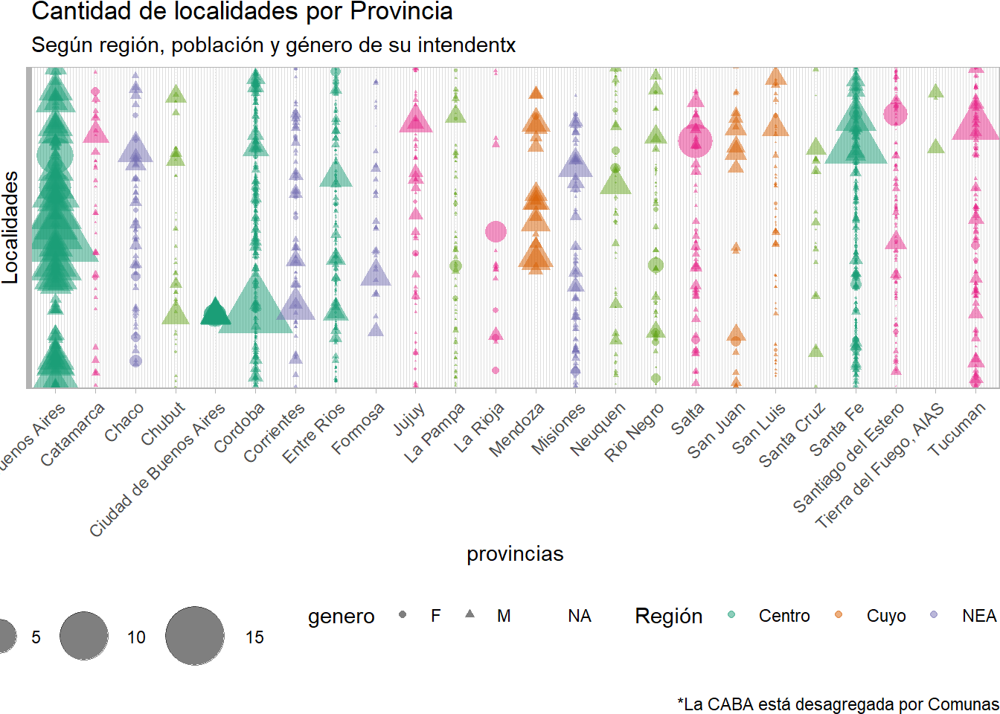
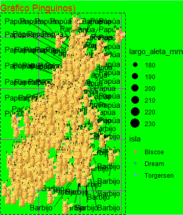

```{r setup, include=FALSE}
knitr::opts_chunk$set(echo = TRUE)

library(dplyr)
```
## Trabajos finales

Trabajos finales utilizando Tableau o RMarkdown y ggplot2. 

```{r echo=FALSE}
tribble(
  ~base, ~link, ~autores,
"Empleo y Género (Banco Mundial)", "https://data-viz-r.netlify.app/","Couto, Aramburu, Araujo",
"Encuesta Permanente de Hogares", "https://ephybrechas.netlify.app/","Juan Videla y Juan Pablo Costa",
"Encuesta Permanente de Hogares", "https://ingresos-genero-desigualdades.netlify.app/", "Nicole Moscovich",
"Encuesta Nacional de Hogares", "https://trabajovisualizacion.netlify.app/","Marcela Almeida",
"Exportaciones certificadas de soja SENASA", "https://vibrant-wozniak-6e07cd.netlify.app/", "Alexander Sothmann,Luciano Tincani, Sara Reidel, Pamela Sarco",
"Programa Punto Digital", "https://public.tableau.com/app/profile/ana.clara.suiffet/viz/ResumenPuntosDigitales/ResumenPuntosDigitales?publish=yes", "Ana Clara Suiffet",
"Monitor de vacunación COVID-19 en la ciudad de Corrientes", "https://public.tableau.com/views/Trabajopracticofinalvisualizacion/MonitordevacunacinporCovid-19enlaCiudaddeCorrientes?:language=en-US&publish=yes&:display_count=n&:origin=viz_share_link","Bianca Vallejos
",
"COVID-19 en CABA", "https://tp-visualizacion-lindenboim-lucena.netlify.app/","Erika D. Lucena, Irene L. Lindenboim",
"COVID-19 - Chubut", "https://diplounab-chubut.netlify.app/","Federico Santoro",
"Estimaciones Agrícolas del Ministerio de agricultura, ganadería y pesca","https://agitated-easley-c144bb.netlify.app/","Yanil Hepp",
"Ecobicis Buenos Aires", "https://ecobicibuenosaires.netlify.app/","Marcelo Perazzo - Paula D’Alessandro",
"Hablemos de Todo","https://public.tableau.com/app/profile/nicolas7443/viz/HDTNicolsNatali/Dashboard1?publish=yes","Nicolás Natali",
"Contratos de alquiler del estado", "https://public.tableau.com/views/TPFINALVISUALIZACIONES/VISUALIZACIONES?:language=es-ES&publish=yes&:display_count=n&:origin=viz_share_link", "Noelia Andrada",
"Vinos", "https://public.tableau.com/app/profile/edgardosandoval/viz/VinosSand/Dashboard1","Edgardo Sandoval"
) %>% 
  mutate(link = paste0("<a href=", link, ">", link, "</a>")) %>% 
  DT::datatable(colnames = c("Base de datos seleccionada", "Link al trabajo final", "Autores/as"),
                escape = FALSE)
```
## Concurso el gráfico más feo (por orden alfabético)

### Agustín Osés

```{r eval=FALSE}
library(dplyr)
library(ggplot2)
library(readr)
library(tidyverse)
library(readxl)
library(datos)
library(png)
library(patchwork)

petroleo <- readPNG("datos/petroleo.png",native = TRUE)
torres <- readPNG("datos/torres.png",native = TRUE)

aviones_2 <- aviones %>% 
  group_by(anio) %>% 
  summarise(mean(asientos))
  
  colnames(aviones_2) <- c("anio", "promedio")

ggplot(aviones_2, aes(x=anio, y=promedio)) +
  theme_dark()+
  theme(plot.title = element_text(size = 15, colour = "brown", face = "italic"), plot.subtitle = element_text(size = 12, colour = "yellow", face = "italic"), plot.background = element_rect (fill = "violet"), plot.caption = element_text(size=9, color = "green"))+
  theme(panel.grid.major = element_line(color = "grey", size = 1, linetype = "dashed"))+
  theme(axis.title = element_text(colour = "orange", face = "italic", size = 20))+
  theme(axis.text.x = element_text(colour= "red", angle = 60,))+
  theme(axis.text.y = element_text(colour= "red", angle = -45,))+
  labs(x= "año", y = "asientos Promedio", title = "Cantidad Promedio de Asientos Por Avión Según Año de Fabricación", subtitle = "capacidad promedio de Aeronaves y su relación con hEchos históricos", caption = "fuente: paquete datos, DATASET Aviones, según registros de la FAA (Administración Federal de Aviación, EEUU") +
  geom_rect(aes(xmin=1956,xmax=1973,ymin=-0,ymax=250), fill="Brown", alpha=1)+
  geom_rect(aes(xmin=1973,xmax=2001,ymin=-0,ymax=250), fill="Yellow", alpha=1)+
  geom_rect(aes(xmin=2001,xmax=2013,ymin=-0,ymax=250), fill="Green", alpha=1)+
  geom_point(aes(size=promedio), colour="blue", shape=17)+
  geom_vline(aes(xintercept=1973), colour=1, size=3)+
  geom_vline(aes(xintercept=2001), colour=2, size=3)+
  geom_smooth(size=3, colour ="Grey")+ 
  inset_element (p= torres, left = 0.9, bottom = 0.15, right = 0.7, top = 0.50)+
  inset_element (p= petroleo, left = 0.25, bottom = 0.65, right = 0.40, top = 1)

```


### Alexander Sothmann

#### Gráfico enviado al concurso

```{r eval=FALSE}
library(tidyverse)
paises <-datos::paises

paises_filtrado <- filter(paises,anio>=2000 & anio<=2021)
ggplot(paises, aes(x = poblacion, y = esperanza_de_vida))+  
  geom_point(aes(size = pib_per_capita))+
  scale_size_area(max_size = 15, guide = NULL) +
  scale_x_log10()+
  geom_smooth(method = "lm", se = FALSE, aes(color = anio))+
   facet_wrap(~continente)+
  labs(title = "Paises del mundo",
       subtitle = "Año 2000 a 2021",
       caption = "El tamaño de cada circulo representa el producto bruto interno por cada habitante.",
       x = "poblacion",
       y = "Life expectancy",
       color = "")
```


#### Gráfico 3D extra

```{r eval=FALSE}
library(scatterplot3d)
paises <-datos::paises

x <- paises$poblacion
y <- paises$esperanza_de_vida
z <- paises$anio

scatterplot3d(x, y, z, pch = 19, color = "blue")
```


### Ana Clara Suiffet


```{r eval=FALSE}
ggplot(provincia_porc, aes(x=1, y=percentage,fill=provincia)) +
  geom_bar(stat="identity") +
  scale_fill_manual(values=rainbow(24)) +  
  geom_text(aes(label = paste0(round(percentage,1),"%")), 
                  position = position_stack(vjust = 0,5)) +
  coord_polar(theta= "y") +
  theme_void()+
  labs(
    x = "Provincias Argentinas",
    y = "Porcentaje de Puntos Digitales",
    title="Porcentaje de Puntos Digitales por Provincias",
    subtitle = "Intento n°99247892 con lo que Yani detesta: gráfico de torta en 3D o 45° y colorinche",
    fill = "Porcentaje",
    caption = "Fuente: mapa de Puntos Digitales https://mapa.puntodigital.gob.ar/")
```


### Analia Savino

```{r eval=FALSE}
expo_biodiesel <- expo_biodiesel %>% 
  mutate(fecha_corregida = dmy(fecha))

expo_biodiesel <- expo_biodiesel %>% 
  select(fecha_corregida, pais_destino, cantidad_ton, monto_fob) %>% 
  mutate(ano = year(fecha_corregida))

exp_bio_limpio <- expo_biodiesel %>% 
  group_by(pais_destino) %>% 
  summarise(cant_ton =sum(cantidad_ton), monto = sum(monto_fob)) %>% 
  ungroup() %>% 
  filter(cant_ton <=15000)

ggplot(exp_bio_limpio) +
  geom_col(aes(x= pais_destino, y= cant_ton, fill=monto))+
  labs(title = "Paises a los que menos biodisel exporatmos",
       x="Paises", 
       y= "Toneladas")
```


### Bianca Vallejos

```{r eval=FALSE}
# Fuente de datos: cotizaciones extraidas de Ambito (https://www.ambito.com/contenidos/merval-historico.html)

grafico_1 <- ggplot(cotizacion, aes(fecha, precio_cierre, col = mes)) +
  geom_line() +
  geom_point() + 
  theme(axis.title.x=element_blank(),
        axis.text.x=element_blank(),
        axis.ticks.x=element_blank(),
        panel.background = element_rect(fill="light green"),
        text=element_text(family="Comic Sans MS")) +
  labs(title = "Cotizacion diaria del MERVAL", subtitle = "Año 2021")
grafico_final <- ggdraw(grafico_1) + 
  draw_image("https://i.pinimg.com/564x/44/a3/d1/44a3d17dea5ec11f27445fece8e137ba.jpg",
             scale = .43, x = 1, hjust = 1, halign = 0.135, valign = 0.12)
grafico_final

ggsave("grafico_final.jpg", width = 7, height = 4)
```


### Erika Lucena

```{r eval=FALSE}
library(datos)
library(readr)
library(dplyr)
library(ggplot2)
library(png)
library(patchwork)

precio_mediana<- diamantes %>% 
  summarise(precio_mediana= median(precio))

precio_max<- diamantes %>% 
  summarise(precio_max= max(precio))


grafico_feo <- diamantes %>% 
  ggplot()+
  geom_boxplot(aes(corte, precio, fill=corte))+
  geom_line(aes(quilate, precio, color=corte))+
  labs(title='¿El precio del corte "Ideal" puede ser menor al resto de los cortes?', subtitle="La mediana del precio para el corte de análisis es menor que en el resto de los cortes", caption= "Fuente:Base Diamantes de la librería Datos de R")+
  geom_hline(data=precio_mediana, aes(yintercept = precio_mediana), color="yellow", linetype=2)+
  geom_hline(data=precio_max, aes(yintercept = precio_max), color="yellow", linetype=2)+
  theme(text= element_text(color="red", face="bold"), plot.background = element_rect (fill = "pink"), panel.grid.major.x= element_line(size=1, color="red", linetype = "3313"), panel.grid.major.y=element_line(size=1, color="red", linetype = "dotdash"),  legend.background= element_blank(), panel.background= element_rect(fill="green"))+
  annotate('text', x = 4.5, y = precio_mediana$precio_mediana-500, label = "Mediana del Precio para todos los cortes", fontface = "bold", size=2, color="yellow")+
  annotate('text', x = 4, y = precio_max$precio_max+500, label = "Precio Máximo", color="yellow", fontface = "bold", size=2)

grafico_feo 

```


### Juan Videla

```{r eval=FALSE}

```


### Manuel Emilio Lopez

```{r eval=FALSE}

```




### Juan Pablo Costa

```{r eval=FALSE}

```


### Mercedes Araujo

```{r eval=FALSE}

```


### Facundo Monti

```{r eval=FALSE}

```


### Federico Aramburu

```{r eval=FALSE}

```


### Federico Gonzalez

```{r eval=FALSE}

```


### Federico Santoro

```{r eval=FALSE}

```


### Hernan Costa

```{r eval=FALSE}

```


### Irene Lindenboim

```{r eval=FALSE}

```


### Julieta Couto

```{r eval=FALSE}

```


### Luciano Tincani y Pamela Sarco

```{r eval=FALSE}

```


### Marcela Almeida

```{r eval=FALSE}

```


### Marcelo Perazzo

```{r eval=FALSE}

```


### Martina Pesce

```{r eval=FALSE}

```



### Martin Saralegui

```{r eval=FALSE}

```


### Marcela Almeida 

```{r eval=FALSE}

```


### Mercedes Laurenza

```{r eval=FALSE}

```


### Nicolas Capria

```{r eval=FALSE}

```


### Nicolas Natali

```{r eval=FALSE}

```


### Nicole Moscovich

```{r eval=FALSE}

```


### Noelia Andrada

```{r eval=FALSE}

```


### Paula DAlessandro

```{r eval=FALSE}

```


### Samantha Vaccari

```{r eval=FALSE}

```


### Sara Reidel

```{r eval=FALSE}

```


### Walter Martinez

```{r eval=FALSE}

```


### Yamila Albornoz

```{r eval=FALSE}

```


### Yanil Hepp

```{r eval=FALSE}

```

