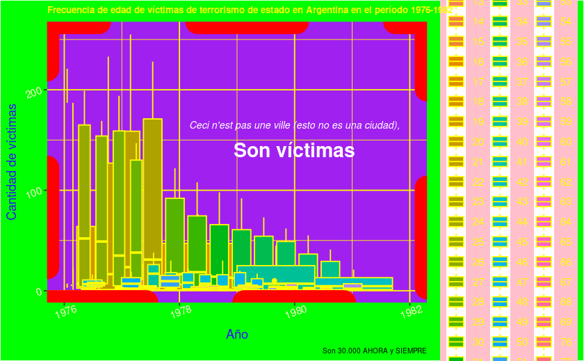
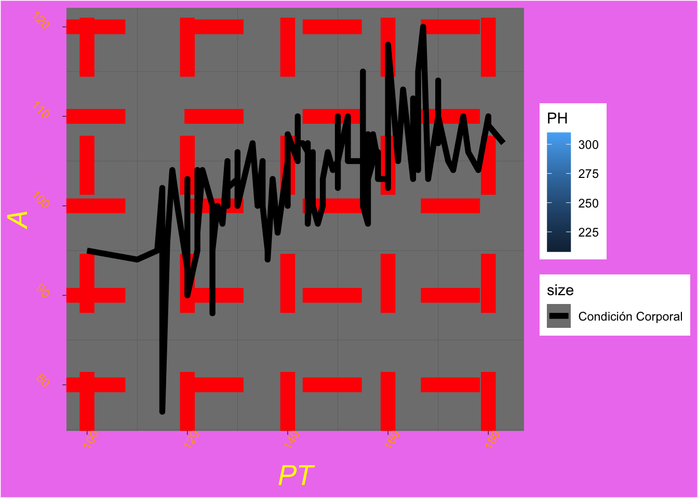
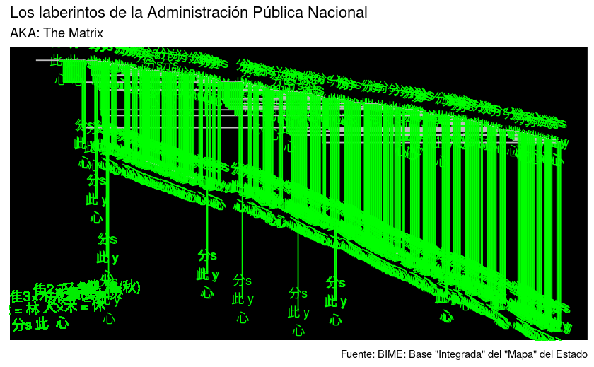
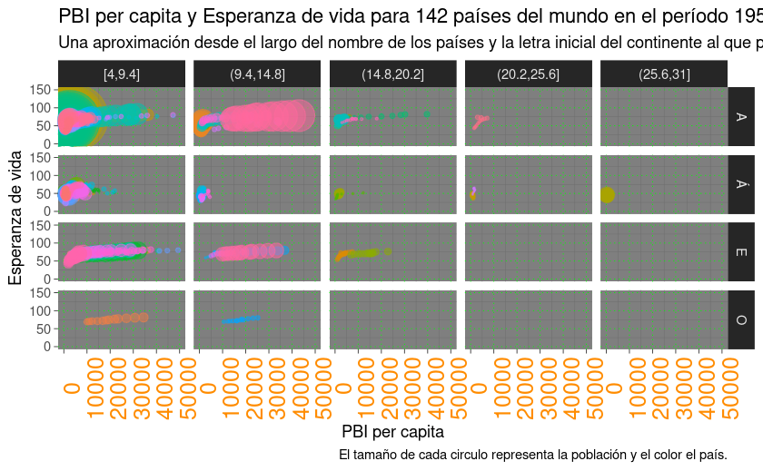
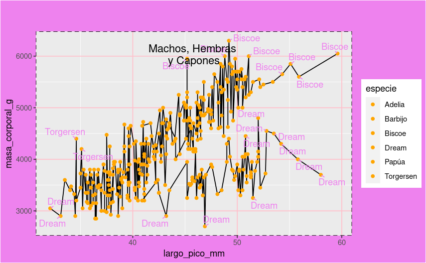
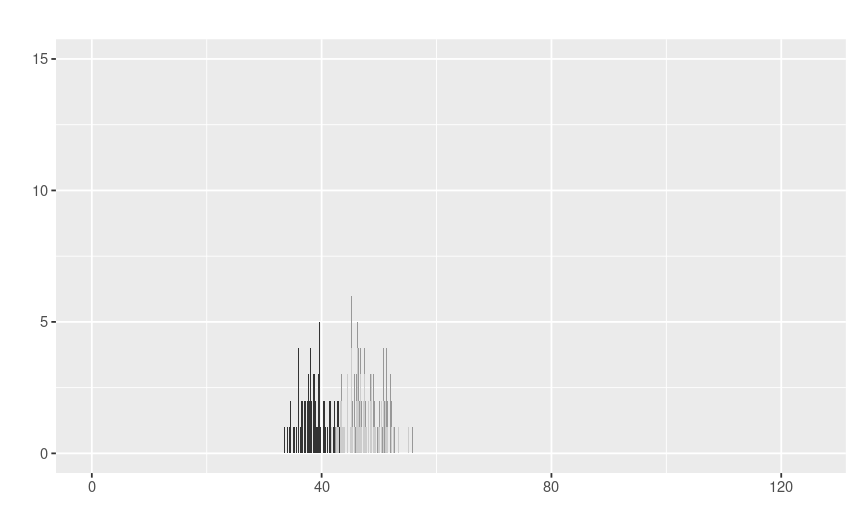
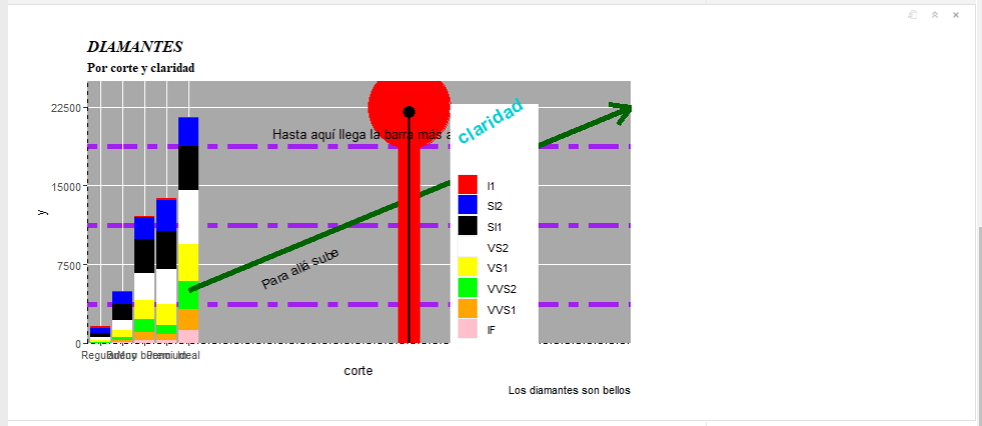
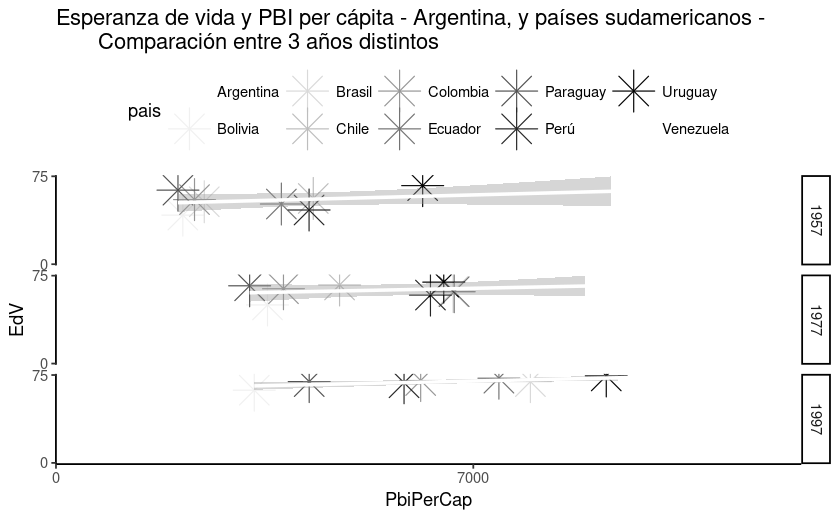
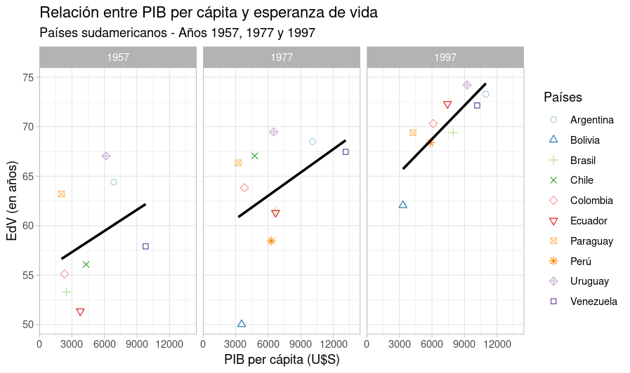

```{r setup, include=FALSE}
knitr::opts_chunk$set(echo = TRUE)

library(dplyr)
```
## Trabajos finales

Trabajos finales utilizando Tableau o RMarkdown y ggplot2. 

```{r echo=FALSE}
tribble(
  ~base, ~link, ~autores,
"Informe estadístico sobre la brecha laboral en cuestiones de género en Argentina (1982-2018)", "https://glittering-bienenstitch-108a82.netlify.app/","Patricia Perrone y Marianela Pi",
"Estructura poblacional de una tropa de llama", "https://github.com/DiploDatosUNAB/visualizacion/blob/main/final_2022/claudia_leonardo.Rmd", "Claudia Martinez y Leonardo Paoli",
"Uso del Tiempo ", "https://splendorous-froyo-66c2d6.netlify.app/", "Samantha Horwitz y Matías Rodriguez Mendoza",
"Transporte en Argentina", "https://tpvisualizaciones.netlify.app/", "Ariana Bardauil, Constanza Guerrini, Alberto Fernandez",
"Análisis de Encuesta de uso de bicicletas públicas de la Municipalidad de Rosario. Año 2016", "https://github.com/DiploDatosUNAB/visualizacion/blob/main/final_2022/clara_bonpland.Rmd", "Clara Bonpland",
"Reseñas de vinos", "https://lively-florentine-84a6ce.netlify.app/", "Ankudowicz Santiago y Ferrero Kevin",


) %>% 
  mutate(link = paste0("<a href=", link, ">", link, "</a>")) %>% 
  DT::datatable(colnames = c("Base de datos seleccionada", "Link al trabajo final", "Autores/as"),
                escape = FALSE)
```

<br>

## Concurso el gráfico más feo

Los gráficos están listados por orden alfabético

<br>

### Clara Bonpland

```{r eval=FALSE}
library(presentes)
library(tidyverse)
library(lubridate)

victimas_parque <- select(parque_de_la_memoria, id, edad, fecha_de_secuestro, ano_en_monumento, lugar_de_secuestro, ocupaciones, sexo, militancia)

edad_victimas <- victimas_parque %>%  
  group_by(fecha_de_secuestro) %>%
  mutate(fecha = dmy(fecha_de_secuestro)) %>% 
  mutate(anio = year(fecha)) %>% 
  group_by(edad, anio) %>% 
  filter(anio %in% c(1976:1982)) %>%
  summarise(victimas_por_anio = n()) %>% 
  arrange(desc(victimas_por_anio)) 

ggplot(edad_victimas,aes(anio, victimas_por_anio)) +
  geom_boxplot(aes(fill = edad), color = "yellow", position = "dodge") +
  scale_x_continuous(limits = c(1976, 1982)) +
  labs(
    title = "Frecuencia de edad de víctimas de terrorismo de estado en Argentina en el período 1976-1982", 
    caption = "Son 30.000 AHORA y SIEMPRE", 
    x = "Año",
    y = "Cantidad de víctimas",
    fill = "Edad") +
  annotate("text", x = 1980, y = 165, color = "white", fontface = "italic", size = 3,
       	label = "Ceci n'est pas une ville (esto no es una ciudad),") +
    annotate("text", x = 1980, y = 140, color = "white", fontface = "bold", size = 6,
       	label = "Son víctimas") +
  theme_bw() +
  theme(panel.grid = element_line(color = "yellow"),
        panel.background = element_rect(fill = "purple"),
        panel.border = element_rect(linetype = "dashed", color = "red", size = 10) ,
        legend.background = element_rect(fill = "pink"),
        legend.text = element_text(color = "yellow"),
        plot.title = element_text(color = "yellow", size = 8, face = "bold"),
        plot.caption = element_text(size = 6), 
        plot.background = element_rect(fill = "green"),
        axis.title = element_text(color = "#2916F5"),
        axis.text = element_text(angle = 20, color = "#FFFFCC")) 

```




<br>

### Claudia Martinez


```{r eval=FALSE}
library(tidyverse)
library(readxl)

BD_Queta <- read_excel("BD_Queta.xlsx", sheet = "BD_VATI", skip = 4)

BD_VT <- select(BD_VALENTINA_TINTE, "PT", "PH", "A", "Condición Corporal")

ggplot(BD_VT,aes(x = PT, y = A)) +
geom_line(aes(color = PH)) +
  geom_line(aes(size = "Condición Corporal")) +
  theme_dark() +
  theme(plot.title = element_text(size = 13, colour = "yellow", face = "italic"), plot.subtitle = element_text(size = 1, colour = "yellow", face = "italic"), plot.background = element_rect (fill = "violet"), plot.caption = element_text(size=9, color = "white")) +
  theme(panel.grid.major = element_line(color = "red", size = 5, linetype = "dashed"))+
  theme(axis.title = element_text(colour = "yellow", face = "italic", size = 20))+
  theme(axis.text.x = element_text(colour= "orange", angle = 60,))+
```


<br>

### Federico Montagna


```{r eval=FALSE}
library(readr)
library(igraph)
library(tidygraph)
library(igraphdata)
library(ggraph)

BIME <- read_csv("BIME_estructura_autoridades_apn_20221116.csv")

Mapa <- BIME |> 
  rename("from" = reporta_a,
         "to" = unidad)

Mapa |> 
  head(500) |> 
  ggraph(layout = 'fabric') +
    geom_node_text(aes(label = "分s\n此 y\n心"), color = "green") +
    geom_node_range(colour = 'grey') + 
    geom_edge_span(colour = 'green', end_shape = 'triangle') + 
    geom_text(x = 5, y = 5, label = "分s 此  心",
            size=4, angle= 3,col="green2") +
    geom_text(x = 12, y = 30, label = "木2 = 林 人×木 = 休",
            size=4, angle= 3,col="green2") +
    geom_text(x = 20, y = 50, label = "隹3×木 = 雧(集)",
            size=4, angle= 3,col="green2") +
    geom_text(x = 30, y = 60, label = "隹2×又= 雙",
            size=4, angle= 3,col="green2") +
    geom_text(x = 40, y = 44, label = "女×子 = 好",
            size=4, angle= 3,col="green2") +
    geom_text(x = 50, y = 50, label = "木2×火 = 焚",
            size=4, angle= 3,col="green2") +
    geom_text(x = 60, y = 60, label = "禾×龜 = 龝(秋)",
            size=4, angle= 3,col="green2") +
    labs(title="Los laberintos de la Administración Pública Nacional", subtitle="AKA: The Matrix", caption= 'Fuente: BIME: Base "Integrada" del "Mapa" del Estado') +
    theme(panel.background = element_rect(fill = "black"))
```




<br>

### Kevin Ferrero

```{r eval=FALSE}
library(tidyverse)
library(stringi)

paises <- datos::paises

paises <- mutate(paises, largo_nomb_pais = str_length(pais),
                 prime_letra_conti = substr(continente, 1,1))

paises <- mutate(paises, largo_nomb_pais = cut_interval(largo_nomb_pais, n = 5))

ggplot(paises, aes(pib_per_capita, esperanza_de_vida))+
  geom_point(aes(size = poblacion, 
                 color = pais), 
             show.legend = FALSE, 
             alpha = 0.5)+
  scale_size_area(max_size = 20, 
                  guide = NULL)+
  scale_y_continuous(limits = c(0, 150))+
  scale_x_continuous(limits = c(0, 50000))+
  facet_grid(prime_letra_conti~largo_nomb_pais)+
  labs(title = "PBI per capita y Esperanza de vida para 142 países del mundo en el período 1952-2007",
       subtitle = "Una aproximación desde el largo del nombre de los países y la letra inicial del continente al que pertenecen",
       caption = "El tamaño de cada circulo representa la población y el color el país.",
       x = "PBI per capita",
       y = "Esperanza de vida",
       color = "")+
  theme_dark()+
  theme(axis.text.x = element_text(size = 15, 
                                   angle = 90, 
                                   color = "darkorange"),
        panel.grid.major = element_line(linetype = "dotted",
                                        color = "green"),
        )
```




<br>

### Marianela Pi

```{r eval=FALSE}
library(tidyverse)
library(datos)
library(ggrepel)

ggplot(pinguinos, aes(largo_pico_mm, masa_corporal_g)) + 
  geom_line(aes(fill=especie)) +
  geom_point(aes(fill=isla), color="orange") +
  geom_text_repel(aes(label=ifelse((masa_corporal_g|largo_pico_mm), 
  as.character(isla))),min.segment.length = 0, seed = 25, color="violet")+
  theme(panel.border = element_rect(linetype = "dashed", fill = "NA"))+
  theme(panel.grid.major = element_line(colour = "pink"))+
  theme(plot.background = element_rect(fill = "violet"))+
  labs(title='Machos, Hembras \ny Capones')+
  theme(plot.title=element_text(vjust=-15, hjust=0.5))
```




<br>

### Matías Rodriguez Mendoza

```{r eval=FALSE}
library(ggplot2)
library(datos)

pinguinos |> 
  ggplot(aes(largo_pico_mm)) +
  geom_bar(aes(fill = especie), show.legend = FALSE) +
  labs(
    title = "",
    x = "",
    y = ""
  ) +
  scale_y_continuous(limits = c(0, 15)) +
  scale_x_continuous(limits = c(0, 125)) +
  scale_fill_grey() 

```




<br>

### Patricia Perrone

```{r eval=FALSE}
library(tidyverse)
library(datos)
library(extrafont)

loadfonts(device = "win")
fonts() # no logré que funcionen las fonts pero si las familias de letras

ggplot(diamantes, aes(x = corte)) +
  geom_bar(aes(fill = claridad)) +
  scale_x_discrete() +
  scale_y_continuous(limits = c(0, 25000), breaks = seq(0, 25000, 7500), expand = c(0, 1))+
  scale_fill_manual(values = c("red","blue", "black", "white", "yellow", "green", "orange", "pink"))+
  labs(	title = "DIAMANTES", subtitle = "Por corte y claridad", caption = "Los diamantes son bellos") +
  annotate("text", x = 10, y = 7300, angle = 25, label = "Para allá sube") +
  annotate("segment", x = 5, xend = 25, y = 5000, yend = 22500, color = "darkgreen", arrow = arrow(), size = 2) + 
  annotate("pointrange", x = 15, y = 22500, ymin = 0, ymax = 22500, colour = "red", size = 8) +
  annotate("pointrange", x = 15, y = 22000, ymin = 0, ymax = 22500, colour = "black", size = 1) +
  annotate("text", x = 13.2, y = 20000, angle = 0, label = "Hasta aquí llega la barra más alta") + 
  theme(panel.grid.minor = element_line(color = "purple", linetype = "twodash", size = 2),
        panel.background = element_rect(fill = "darkgray"),
        legend.position = c(.75,.45),
        legend.title = element_text(color = "darkturquoise", size = 16, face = "bold", angle = 30),
        plot.title = element_text(face = "bold.italic", family = "serif"),
        plot.subtitle = element_text(face = "bold", family = "serif"),
        axis.line.y = element_line(linetype = 8),
        axis.line.x = element_line(linetype = 4),
        plot.margin = margin(5, 5, 5, 5, "mm")
        )
```




<br>

### Samantha Horwitz

```{r eval=FALSE}
library(tidyverse)
library(datos)

paises1 <- paises %>%
  filter(anio %in% c('1957', '1977', '1997')) %>%
  filter(continente %in% c('Américas')) %>%
  filter(pais %in% c('Argentina', 'Bolivia', 'Brasil', 'Chile', 'Colombia', 'Ecuador', 'Paraguay', 'Perú', 'Uruguay', 'Venezuela')) %>%
  group_by(pais, continente, poblacion, esperanza_de_vida, pib_per_capita)

# Gráfico versión fea

ggplot(paises1, aes(x = pib_per_capita, y = esperanza_de_vida)) +
  geom_point(aes(color = pais), size = 8, shape = 8) +
  geom_smooth(method = "lm", color = "white") +
  scale_x_continuous(limits = c(0, 12500), breaks = seq(0, 12500, 7000), expand = c(0, 1)) +
  scale_y_continuous(limits = c(0, 75), breaks = seq(0, 75, 75), expand = c(0, 1)) +
  scale_color_brewer(palette = "Greys") +
  labs(title="Esperanza de vida y PBI per cápita - Argentina, y países sudamericanos -
       Comparación entre 3 años distintos", 
       x = "PbiPerCap", 
       y = "EdV") +
  facet_grid("anio") +
  theme_classic() +
  theme(legend.position = "top")


```


```{r eval=FALSE}
# Intento de gráfico bien hecho

ggplot(paises1, aes(x = pib_per_capita, y = esperanza_de_vida)) +
  geom_point(aes(color = pais, shape = pais), size = 2) +
  geom_smooth(method = "lm", se = FALSE, color = "black") +
  scale_x_continuous(limits = c(0, 14500), breaks = seq(0, 15500, 3000), expand = c(0, 1)) +
  scale_y_continuous(limits = c(50, 75), breaks = seq(0, 75, 5), expand = c(0, 1)) +
  scale_color_brewer(palette = "Paired") +
  scale_shape_manual(values = c(1:9, 22)) +
  labs(title = "Relación entre PIB per cápita y esperanza de vida", subtitle = "Países sudamericanos - Años 1957, 1977 y 1997", 
       fontface = "bold",
       x = "PIB per cápita (U$S)",
       y = "EdV (en años)",
       size = 3,
       color = "Países", 
       shape = "Países", 
       size = 4) +
   facet_wrap("anio") +
  theme_light()+
  theme(legend.position = "right",
        legend.background = element_rect(fill = "white", color = NA))
```


